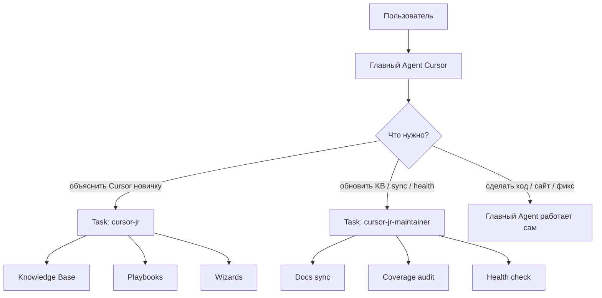
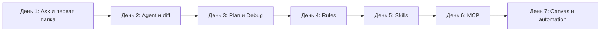
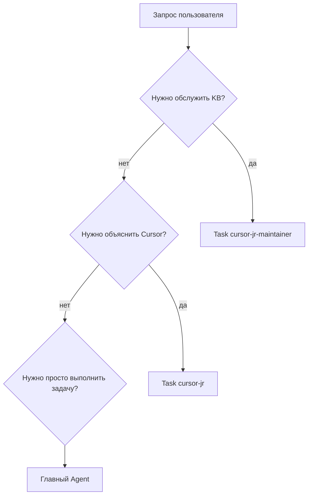

# CursorJr

**CursorJr** — русскоязычный субагент-наставник для Cursor. Он помогает обычным людям: предпринимателям, маркетологам, дизайнерам, контентщикам и новичкам в разработке — понять Cursor, автоматизировать рутину и безопасно делегировать задачи AI-агенту.

CursorJr объясняет без техножаргона: что нажать, какой режим выбрать, как не сломать проект, как подключать MCP, создавать rules/skills, собирать отчёты в Canvas и превращать повторяющиеся задачи в понятные сценарии.

[](#быстрая-локальная-установка)
[](https://t.me/maya_pro)

## Для кого

- Для тех, кто открыл Cursor впервые и не понимает, с чего начать.
- Для предпринимателей, которым нужен AI-помощник для рутины, контента и процессов.
- Для маркетологов и контентщиков, которые хотят быстрее собирать тексты, лендинги, SEO-структуры, отчёты и контент-планы.
- Для дизайнеров и продюсеров, которым нужно объяснить Cursor простыми словами и без “программистского входа”.
- Для команд, где Cursor должен стать понятным рабочим инструментом, а не страшной IDE.

## Что умеет

- Объясняет `Ask`, `Plan`, `Agent`, `Debug` человеческим языком.
- Помогает безопасно делать первые правки через diff и checkpoints.
- Объясняет `Rules`, `Skills`, `Subagents`, `MCP`, `Canvas`, Automations и Hooks.
- Показывает, как автоматизировать повторяемую работу.
- Подсказывает, когда нужен rule, skill, MCP или полноценная automation.
- Ведёт новичка по 7-дневному маршруту обучения.
- Разбирает типичные проблемы: “агент всё сломал”, “боюсь терминала”, “MCP не появился”, “нет Publish в Canvas”.
- Имеет отдельного maintainer-субагента для обновления базы знаний.

## Как это устроено



## Маршрут новичка



## Когда вызывать CursorJr



## Установка

### Быстрая локальная установка

Скопируйте команду в PowerShell из папки, куда хотите скачать CursorJr:

```powershell
git clone https://github.com/Horosheff/cursor-jr.git; cd cursor-jr; .\scripts\install-plugin.ps1
```

После установки перезапустите Cursor.

### Ручная установка

Склонируйте репозиторий и запустите установку:

```powershell
git clone https://github.com/Horosheff/cursor-jr.git
cd cursor-jr
.\scripts\install-plugin.ps1
```

Перезапустите Cursor.

После установки доступны:

- `Task(cursor-jr)` — наставник для новичков.
- `Task(cursor-jr-maintainer)` — обслуживание базы знаний.
- `/cursor-jr` — ручной вызов наставника.
- `/cursor-jr-sync` — обновление базы знаний.
- `/cursor-jr-maintain` — maintainer workflow.
- `/cursor-jr-health` — проверка здоровья установки.

## Проверка

```powershell
.\scripts\verify-install.ps1
.\scripts\health-check.ps1
```

Ожидаемый результат:

- `cursor-jr` установлен как readonly-субагент.
- `cursor-jr-maintainer` установлен как maintainer-субагент.
- Старый конфликтующий skill `cursor-jr` отсутствует.
- Coverage базы знаний без пропусков.
- Тесты поведения проходят.

## Структура проекта

| Папка | Назначение |
|-------|------------|
| `agents/` | Субагенты `cursor-jr` и `cursor-jr-maintainer` |
| `rules/` | Маршрутизация: когда звать CursorJr |
| `commands/` | Slash-команды для Cursor |
| `knowledge-base/` | Упрощённая база знаний Cursor на русском |
| `playbooks/` | Практические сценарии: первый запуск, automation, MCP, rollback |
| `wizards/` | Пошаговые мастера для типичных задач |
| `profiles/` | Профили новичков: предприниматель, маркетолог, дизайнер и т.д. |
| `scripts/` | Установка, sync, coverage, health-check |
| `tests/` | Тестовые сценарии поведения субагента |

## База знаний

CursorJr опирается не на четыре страницы, а на карту официальной документации Cursor. Эти ссылки — корневые разделы:

- https://cursor.com/ru/docs
- https://cursor.com/ru/learn
- https://cursor.com/ru/help
- https://cursor.com/ru/docs/api

Отдельно индексируются десятки конкретных страниц по темам:

- Agent, Ask Mode, Plan Mode, Debug Mode, Design Mode и Agent Review;
- Terminal, Browser, Search и Canvas tools;
- Rules, Skills, Subagents и MCP;
- Security, Run Modes и permissions;
- Cloud Agents, Automations и Hooks;
- Teams, Dashboard, usage limits, integrations, Bugbot и Security Agents;
- CLI, SDK и Cloud Agent API.

Реальная карта обработанных URL лежит в `knowledge-base/manifest.json`, а покрытие проверяется скриптом `scripts/audit-coverage.ps1`.

В репозитории лежат не “сырые копии документации”, а упрощённые русскоязычные карточки, playbooks и wizards для новичков. Локальные raw/drafts после sync намеренно не публикуются в GitHub.

## Автоматизация и MCP

CursorJr помогает обычному пользователю понять:

- когда достаточно простого правила `rule`;
- когда нужен повторяемый рецепт `skill`;
- когда подключать внешний сервис через `MCP`;
- когда делать полноценную automation;
- как проверять безопасность перед запуском команд.

## Для авторов и команд

Если вы обучаете команду Cursor, используйте:

- `knowledge-base/learning-path-7-days.md` — мини-курс на неделю;
- `knowledge-base/typical-beginner-failures.md` — база типичных проблем;
- `routing-test-cases.md` — матрица маршрутизации;
- `scripts/health-check.ps1` — быстрая проверка установки.

## Неофициальный проект

CursorJr не аффилирован с Cursor Inc. Это открытый русскоязычный помощник для обучения и внедрения Cursor.

## Контакты

[](https://t.me/maya_pro)

## Лицензия

MIT
