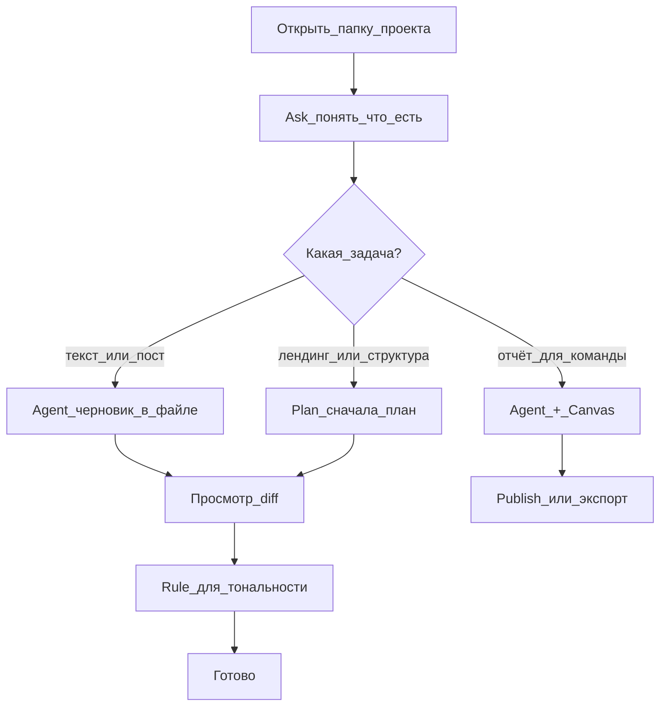

# Playbook 05 — Контент и маркетинг в Cursor

**Для кого:** контентщик, маркетолог, SMM, копирайтер, предприниматель с лендингом  
**Результат:** вы умеете собирать тексты, структуры и отчёты в Cursor без страха «сломать код»

## Схема



## Чеклист

- [ ] Создать папку проекта (например `мой-контент`) и открыть в Cursor
- [ ] Режим **Ask**: «Что уже есть в этой папке? Какие файлы для текстов?»
- [ ] Выбрать одну задачу: пост, лендинг, SEO-структура, контент-план, отчёт
- [ ] Для **одного файла** — режим **Agent**
- [ ] Для **нескольких страниц** — режим **Plan**, прочитать план до одобрения
- [ ] Просмотреть **diff** — зелёное новое, красное удалённое
- [ ] Сохранить tone of voice в **rule** (если будете писать регулярно)
- [ ] Для отчёта коллегам — **Canvas** и Publish (если доступно)

## Промпты (копировать)

**Ask — разведка:**
```
Объясни эту папку простым языком. Какие файлы для текстов, какие для кода? Ничего не меняй.
```

**Agent — один пост или текст:**
```
Создай черновик поста для [платформа] на тему [тема].
Тон: [дружелюбный / экспертный / продающий].
Длина: [короткий / средний].
Сохрани в файл drafts/[название].md
Сначала покажи план в чате, жди моего «да».
```

**Plan — лендинг или серия материалов:**
```
Нужен лендинг для [продукт/услуга].
Целевая аудитория: [кто].
Сначала предложи структуру блоков (заголовки + смысл каждого).
Не создавай файлы, пока я не одобрю план.
```

**Rule — постоянный стиль (попросите главного Agent после playbook):**
```
Создай user rule: мы пишем на русском, без канцелярита, короткие абзацы, без восклицательных знаков подряд.
```

## Типичные задачи

| Задача | Режим | Что попросить |
|--------|-------|---------------|
| Пост в соцсети | Agent | черновик в `drafts/` |
| Текст лендинга | Plan → Agent | структура, потом тексты по блокам |
| SEO-структура статьи | Plan | H1, H2, ключевые фразы, FAQ |
| Контент-план на неделю | Agent + таблица | markdown-таблица в одном файле |
| Отчёт для руководителя | Agent + Canvas | сводка + графики в canvas |
| Переписать чужой текст | Agent | «сохрани смысл, измени тон на …» |

## Безопасность для не-разработчиков

- Не включайте **Run Everything** — пусть Agent спрашивает перед командами
- Тексты и markdown безопасны; если Agent лезет в `package.json` или терминал без нужды — остановите и уточните задачу
- Перед большой правкой — **контрольная точка** (checkpoint)

## Проверка

- В папке появился хотя бы один файл с вашим черновиком
- Вы видели diff и сами решили: принять или отклонить
- Вы понимаете, когда следующий раз выбрать Ask, Plan или Agent

## Следующий шаг

- Повторяемая задача → Playbook 01 (rule + skill)
- Нужен Notion/Google Docs → Playbook 02 (MCP)
- Отчёт для команды → wizard `wizard-share-canvas.md`

## KB

- `knowledge-base/05-praktika/kontent-i-marketing.md`
- `knowledge-base/03-kontekst/rules.md`
- `knowledge-base/02-agent-i-rezhimy/rezhimy-tablica.md`
