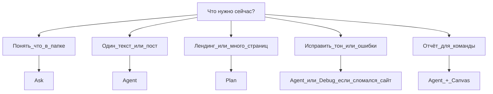

# Wizard — контент и маркетинг

## Цель

Быстро выбрать режим Cursor и получить черновик текста, структуру или отчёт — без правок в коде проекта.

## Быстрый выбор



## Шаги

1. Откройте папку проекта (**File → Open Folder**)
2. Ответьте себе: одна страница или целый набор материалов?
3. **Одна страница** → `Ctrl+I` → **Agent**
4. **Много блоков/файлов** → **Plan**, прочитайте план, потом одобрите
5. **Только посмотреть** → **Ask**
6. Сформулируйте бриф: аудитория, тон, длина, куда сохранить файл
7. После ответа Agent — откройте **diff** и примите только то, что нравится

## Готовые промпты

**Бриф для поста:**
```text
Напиши черновик поста для Telegram.
Тема: [тема].
Аудитория: [кто читает].
Тон: живой, без воды.
Сохрани в drafts/post-[дата].md
Покажи текст в чате до сохранения — жду подтверждения.
```

**Бриф для лендинга (Plan):**
```text
Нужна структура лендинга для [продукт].
ЦА: [описание].
Сначала только план блоков (герой, боли, решение, CTA).
Файлы не создавай, пока я не скажу «делай».
```

**Правило стиля (для главного Agent):**
```text
Создай rule: все тексты на русском, обращение на «вы», без штампов «уникальное решение» и «лучший на рынке».
```

## Проверка

- Есть файл с черновиком или одобренный план
- Вы сами выбрали режим (не угадал Agent за вас)
- Diff просмотрен до принятия

## Куда дальше

| Ситуация | Файл |
|----------|------|
| Полный сценарий на неделю | `playbooks/05-kontent-i-marketing.md` |
| Автоматизация tone of voice | `wizard-automation.md` |
| Отчёт в Canvas | `wizard-share-canvas.md` |
| Таблица режимов | `knowledge-base/02-agent-i-rezhimy/rezhimy-tablica.md` |
